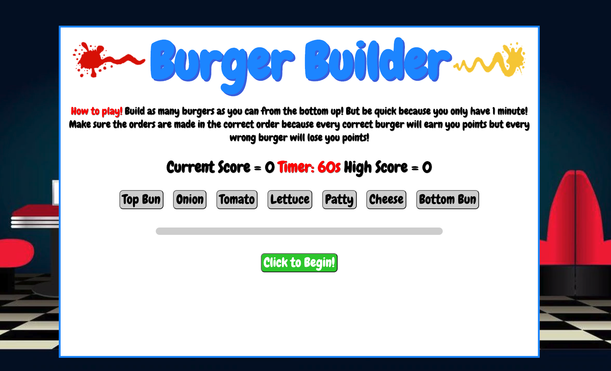

# Burger Builder

Have you ever wanted to get a small glimpse of what it was like behind the scenes of your favorite burger restaurant? With Burger Builder you're able to take the role of the person making the orders! Play this fast paced game from the bottom up and get the highest score you can get! But be accurate! Every correctly made burger will reward you points but every wrong burger will lose you points!

## Motivation
After a long day of class and an empty belly, the thought of where to eat for dinner with my significant other popped into my head. Their favorite food is the typical fast food burger. It wasn't long for the gears to start going from there.

For past homework and lectures, I've had a lot of enjoyment seeing the randomly generated options work, so I wanted to make sure that I implimented that somewhere in my coding.

## How To Play!
Players have 1 minute to build as many burgers from the bottom up. With every burger sent, it will be compared to the customer's order and perfectly matching burgers will gain players points while incorrect burgers will lose points.

## User Stories/Game Logic
- Players will click the starting button to active a 1 minute timer.
- A burger name will be displayed along with the recipe on how to make the burger.
- Players must construct the order from the bottom up (starting with the bottom bun).
- When players are done replicating the order, they push the "Order Up!" button which submits the burger to be checked.
- With every matching burger, players will receive 50 points.
- Every wrong burger will cost players 100 points.
- The user's score gets update automatically.
- After clicking the "Order Up!" button, the building area will reset and a new order appears for the player to create.
- After 1 minute, the option to send an order in will be disabled and text will display how the player did.
- If a user has gotten a highscore, the highscore will replace the recently recorded old score.

## Code Snippets

## Credit
A lot of my function creations came from small snippets of past homework and lectures from my GA SEI-R Program. I compared my timer to that of the timer code from a "Poke-A-Square", I understood the logic of having empty arrays by taking glances at the "High-Card" deliverable, and a lot CSS was taken into consideration from the lesson from the week before.

Any super questionable moments in my code were solved with reaching out to the instructors and using MDN, overstack flow, and w3schools websites of a wide variety.

## Future Development
What are the next steps for this project?
- First and foremost I want to condense and DRY up the code as much as I can. There are a lot of hard coded areas where I could substitute with a proper loop. With the extra time permitted I should have the code looking much cleaner
- I want to possibly make spin-off versions of this game. The world has so many different types of food, why only stop at burgers? I have been thinking of a sushi maker, a taco constructor, and everything in between.